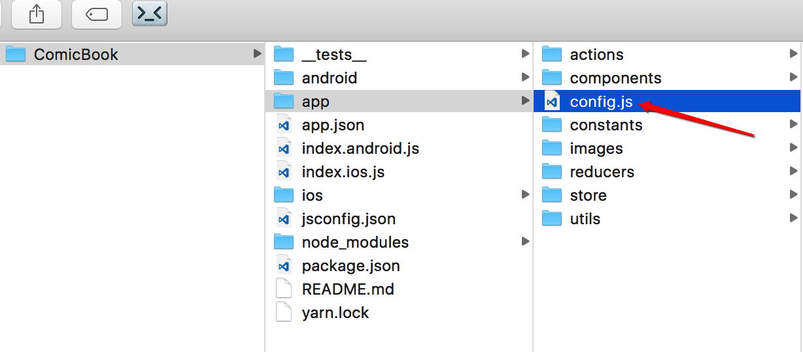

# 基于iOS和Android的react-native跨平台漫画App

## ComicBook
`ComicBook`项目参考了[ComicApp](https://github.com/mobxjs/mobx)的部分设计和部分代码，`ComicBook`是`ComicApp`的重构版。本项目架构清晰，代码简洁，还配套[完整的视频](http://www.kongyixueyuan.com/course/3528)。

## 项目使用须知
1. `$ git clone https://github.com/liyuechun/ComicBook.git`
2. `$ cd ComicBook`
3. `$ npm install`
4. 如下图打开项目配置文件
 


5. 配置说明

```js

import {  
    Platform
} from 'react-native';

/**
 * 运行项目注意事项
 * 1、请移步：https://www.juhe.cn/docs/api/id/163
 * 2、注册账号
 * 3、申请数据,免费可以访问1000次，如果想花钱，可以花99元买20000次，
 * 不想花钱，直接换个手机号再注册申请即可
 * 4、把申请的key替换掉下面的key
*/

/**
 * 备用key
 * 8f28c126609a563c7ce16f6a83369459
 * ed273dc45c5042836181c2356b81db63
*/

/**
 * 将你申请的key替换掉下面的key
 */
export const KEY = "8f28c126609a563c7ce16f6a83369459";


/**
 * Android端是否以抽屉样式展示
 */
const SHOW_ANDROID_DRAWER = true;
// const SHOW_ANDROID_DRAWER = false;

/**
 * iOS端是否以抽屉样式展示
 */
const SHOW_IOS_DRAWER = true;
// const SHOW_IOS_DRAWER = false;

export const IS_TAB_STYLE = Platform.OS === 'ios' && !SHOW_IOS_DRAWER || Platform.OS !== 'ios' && ! SHOW_ANDROID_DRAWER;

```

6. 运行项目

```js
$ react-native start
$ react-native run-ios
$ android avd //启动android模拟器
$ react-native run-android
```


## 效果图

| iOS            | Android       |
| :-------------:|:-------------:|
|      |  |
|       |       |   
|   |       |   
|   |      |   


## 第三方库

1. StackNavigator
2. TabNavigator
3. DrawerNavigator
4. Redux
5. redux-thunk
6. react-static-container
7. react-native-viewpager
8. react-native-sglistview
9. react-native-scrollable-tab-view


## TODOS

1. mobx版本的ComicBook
2. Weex版本的ComicBook
